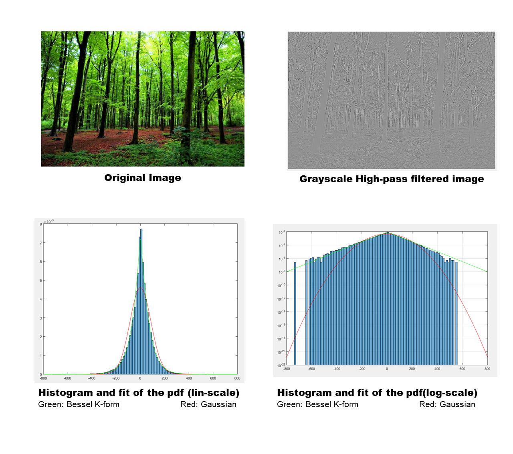

# Estimation of the parameters of a Bessel K-form to categorize images

I thought this project was quite intersting to share. In this work we extract 2 parameters that are meaningful at capturing image variablity.
It is done by fitting the histograms of the gradient of the image. But instead of using a Gaussian distribution, we are estimating the parameters for a Bessel K-form distribution.
This distribution is also caracterized by only 2 parameters but is much better at fitting the histograms. 

Most of the supplementary material is in French but the few comments in the code are in English. 

TPEV1.m is the estimation of the parameters of the Bessel K-form and plots that show the quality of the fit. 
TPEV2.m is a basic estimation of paremeters of a Gaussian distribution (I didn't really have time to implement the multi dimensional Bessel K-form distribution and plots)

